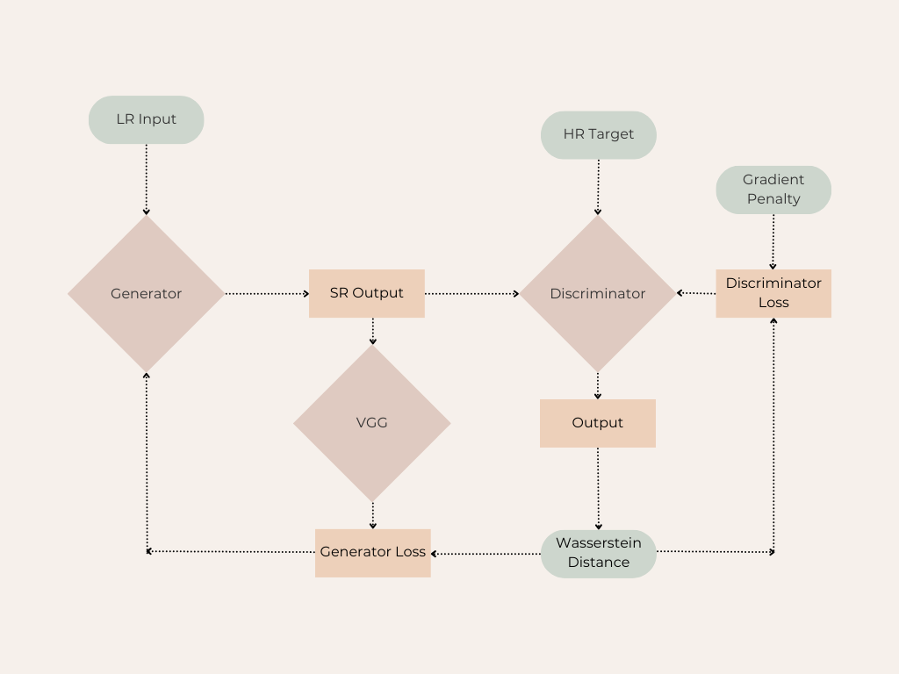

# Super-Resolution Model using Deep Learning

This project focuses on building a Super-Resolution (SR) model using a deep learning approach. The model aims to enhance the resolution of low-resolution images by leveraging a WGAN GP equipped with convolutional neural network (CNN) architecture, specifically a Residual Network (ResNet) combined with UpSampling layers. The model is designed to improve the resolution of the IMD gridded dataset.

## Table of Contents
- [Project Overview](#project-overview)
- [Dataset](#dataset)
- [Model Architecture](#model-architecture)
- [Data Preprocessing](#data-preprocessing)
- [Training](#training)
- [Evaluation](#evaluation)
- [Results](#results)
- [Dependencies](#dependencies)
- [Usage](#usage)
- [References](#references)

## Project Overview

The goal of this project is to enhance low-resolution images (0.25x0.25 km) to a higher resolution (0.0625x0.0625 km) using a SR WGAN-GP. The project uses a dataset containing high-resolution and low-resolution precipitaion dataset. The SR WGAN-GP is trained to minimize the content loss between the generated high-resolution images and the actual high-resolution images.Generator is made to generate High Resolution Images giving the low resolution images as input.

## Dataset

Low_resolution - https://imdpune.gov.in/cmpg/Griddata/Rainfall_1_NetCDF.html
High_resolution  - https://imdpune.gov.in/cmpg/Griddata/Rainfall_25_NetCDF.html

## Model Architecture

## Data Preprocessing
- The dataset contains high-resolution (HR) and low-resolution (LR) images.
- **NaN Handling:** NaN values in the dataset are replaced with 0 to ensure that the model can train without interruptions.

## Training

- **Loss Function:** The model is trained using a combination of Adversarial loss and Perceptual loss (Feature Extractor) for generator and Wasserstein loss with GP for discriminator.
- **Optimizer:** The Adam optimizer is used with a learning rate of `1e-5`.
- **Training Process:** The model is trained for a set number of epochs, with the learning rate being reduced on the plateau to fine-tune the model.

## Evaluation

The model is evaluated based on:
- **PSNR (Peak Signal-to-Noise Ratio):** To measure the quality of the reconstructed images.
- **SSIM (Structural Similarity Index):** To measure the similarity between the ground truth and the generated images.

## Results

The trained SR WGAN-GP model significantly enhances the resolution of the low-resolution images. The results are evaluated using PSNR and SSIM, demonstrating the model's ability to reconstruct high-quality images.

## Dependencies

- TensorFlow
- Keras
- NumPy
- Matplotlib
- Pickle (for loading datasets)
- scikit-image (for calculating PSNR and SSIM)
